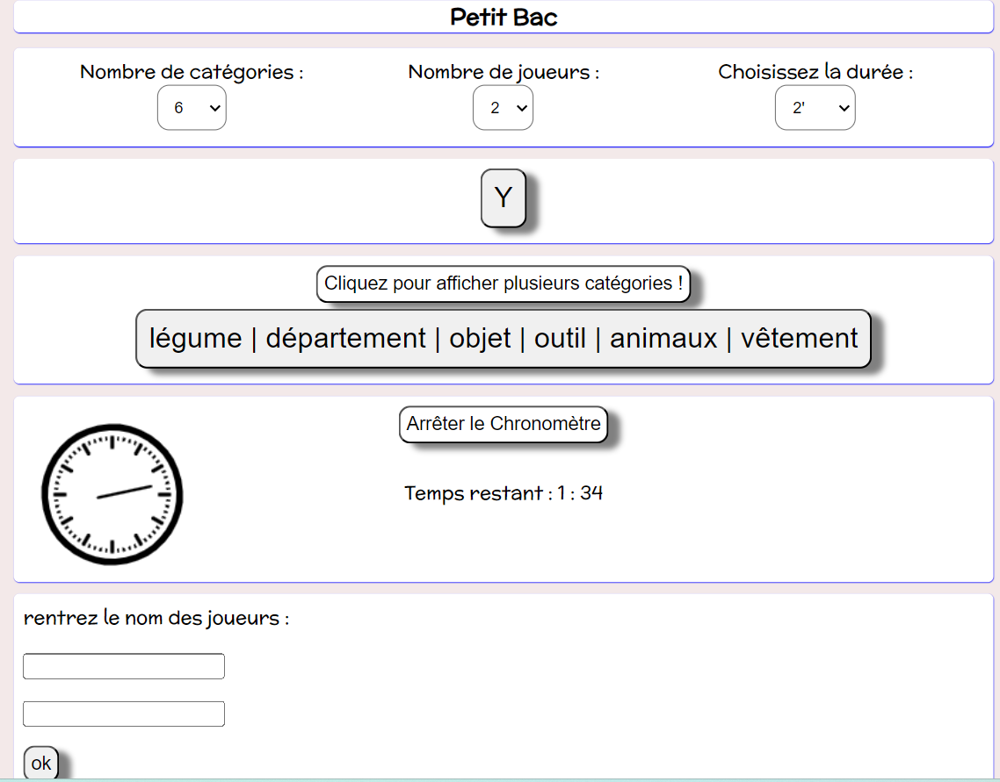

# Petit Bac 

Application web du célèbre jeu avec NodeJs (v18.15.0) et express (4.18.2). Une démo (avec serveur apache et Php) est disponible à l'adresse suivante : http://erwan-diato.com/petitbac/ .
Plusieurs catégories aléatoires sont proposées, il est possible de choisir entre 6 et 11 catégories. 
On peut entrer le nom des joueurs et rentrer leurs scores. Le programme propose un chronomètre avec choix de la durée.

Pour installer le programme :

> docker build . -t petitbac 

> docker run -p 8111:8080 petitbac

Pour jouer : 

> http://localhost:8111/ 
